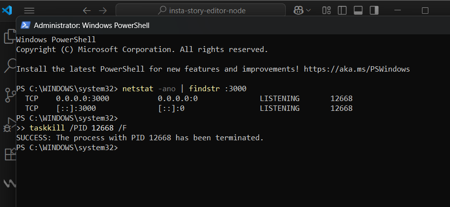
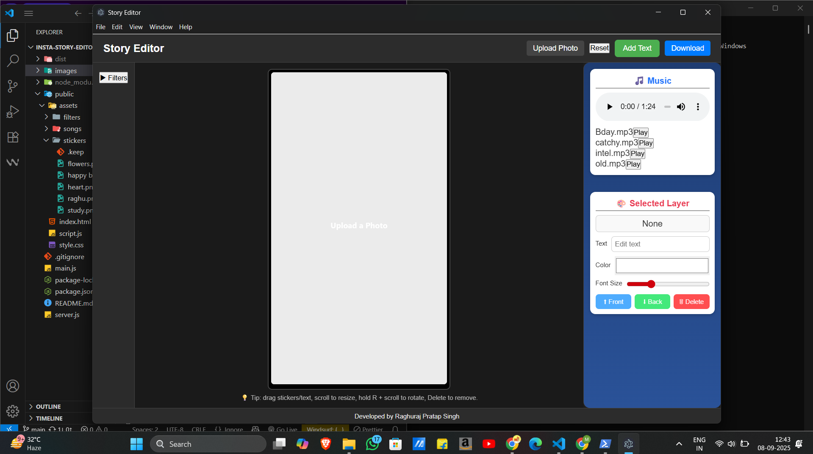
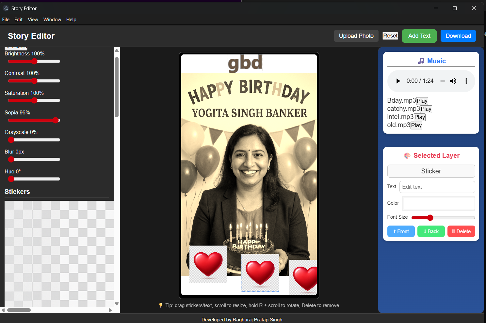
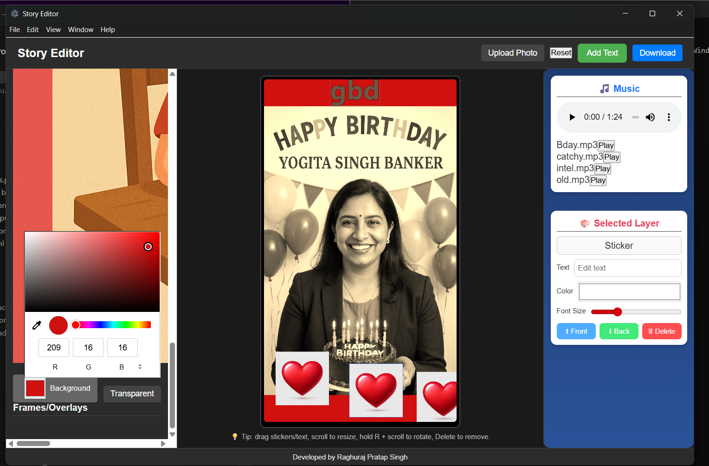
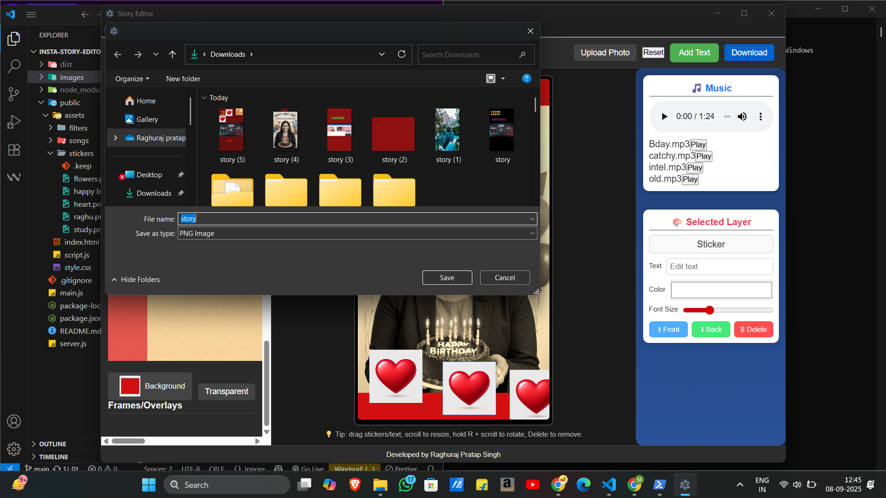
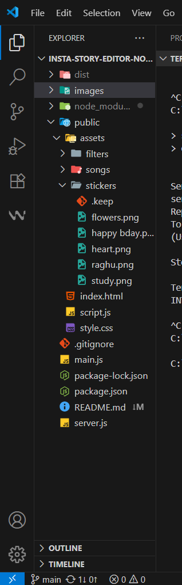
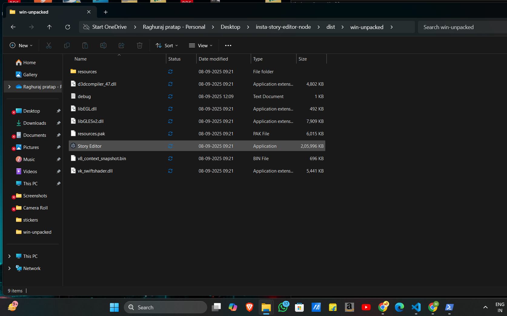

# Story Editor (Node + HTML/CSS/JS, No DB)

A lightweight Instagram-style story editor you can host anywhere. Users can:
- Upload a photo
- Add stickers (from `/public/assets/stickers`)
- Add text (drag, resize with wheel, rotate with R + wheel)
- Apply filters (brightness, contrast, saturation, sepia, grayscale, blur, hue)
- Add optional frame/overlay PNGs (from `/public/assets/filters`)
- Play songs (from `/public/assets/songs`) while editing (audio is not embedded in the exported image)
- Download the final image as `PNG`

> No database required. All assets are static files. The editor runs fully on the client; Node.js only serves files and lists assets.

## Quick start

```bash
npm install
npm run start
# Open http://localhost:3000
```

## Add your assets

- **Stickers:** put `.png`/`.jpg`/`.webp` files into `public/assets/stickers/`
- **Frames/Overlays:** put `.png` (transparent) into `public/assets/filters/`
- **Songs:** put `.mp3` (or `.wav`/`.ogg`) into `public/assets/songs/`

The app auto-lists whatever you put in these folders.

## Deploy

- **Render/Railway/Heroku/Any Node host**: deploy the whole folder and run `node server.js`.
- **Vercel**: use a Node server deployment or convert routes to serverless if you prefer.
- **Static front-end**: You can also serve `/public` via Netlify and expose `/api/*` via a small Express instance on Render.

## Notes

- Export is an image (no audio). If you need video export with audio, you'll need ffmpeg on a server or a WebAssembly approach.
- Canvas uses modern `ctx.filter`; works on current Chrome/Edge/Firefox/Safari.


output________________________________________________________________________________________________________________________
case -1 npm start 
and you get error 

___________

C:\Users\raghu\OneDrive\Desktop\insta-story-editor-node>npm start

> story-editor@1.0.1 start
> electron .


Server Error: (node:3324) [MODULE_TYPELESS_PACKAGE_JSON] Warning: Module type of file:///C:/Users/raghu/OneDrive/Desktop/insta-story-editor-node/server.js is not specified and it doesn't parse as CommonJS.
Reparsing as ES module because module syntax was detected. This incurs a performance overhead.
To eliminate this warning, add "type": "module" to C:\Users\raghu\OneDrive\Desktop\insta-story-editor-node\package.json.
(Use `node --trace-warnings ...` to show where the warning was created)

Server Error: node:events:496
      throw er; // Unhandled 'error' event
      ^

Error: listen EADDRINUSE: address already in use :::3000      
    at Server.setupListenHandle [as _listen2] (node:net:1907:16)
    at listenInCluster (node:net:1964:12)
    at Server.listen (node:net:2066:7)
    at Function.listen (C:\Users\raghu\node_modules\express\lib\application.js:635:24)
    at file:///C:/Users/raghu/OneDrive/Desktop/insta-story-editor-node/server.js:39:5
    at ModuleJob.run (node:internal/modules/esm/module_job:268:25)
    at async onImport.tracePromise.__proto__ (node:internal/modules/esm/loader:543:26)
    at async asyncRunEntryPointWithESMLoader (node:internal/modules/run_main:116:5)
Emitted 'error' event on Server instance at:
    at emitErrorNT (node:net:1943:8)
    at process.processTicksAndRejections (node:internal/process/task_queues:90:21) {
  code: 'EADDRINUSE',
  errno: -4091,
  syscall: 'listen',
  address: '::',
  port: 3000
}

Node.js v22.11.0

Server stopped with code 1

____how to solve it ? 











